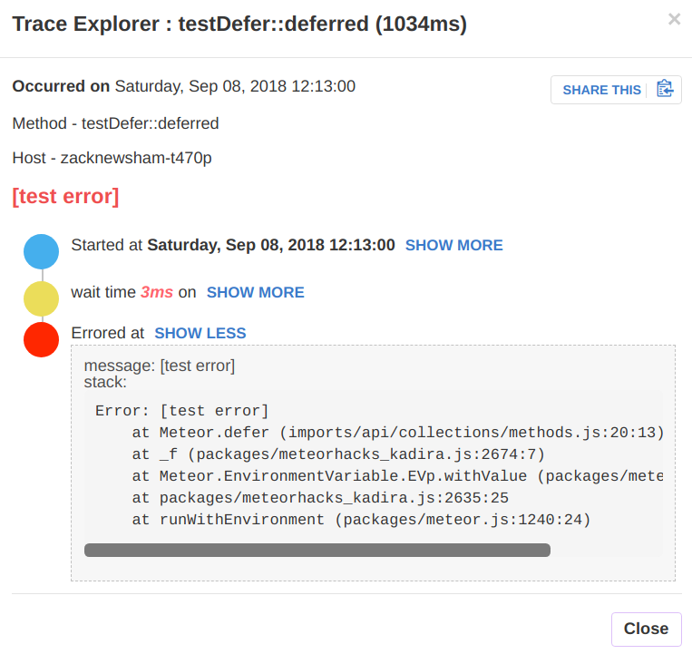
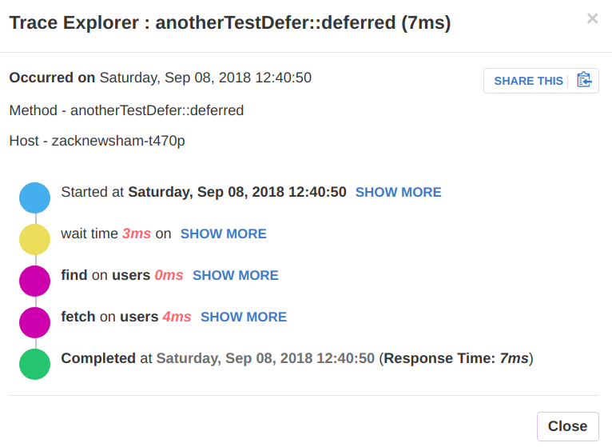
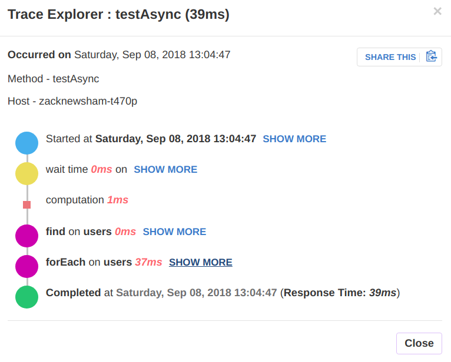
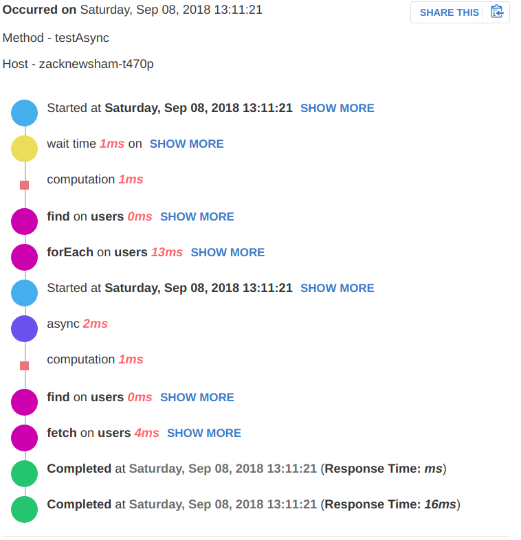
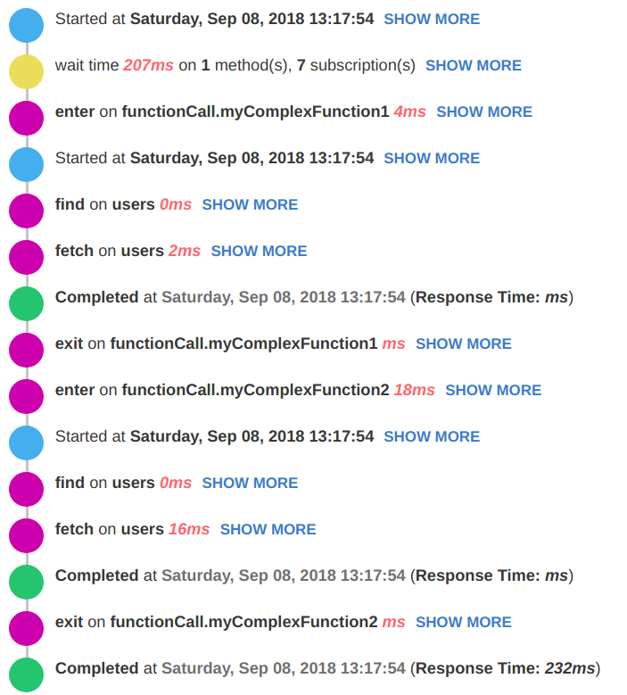
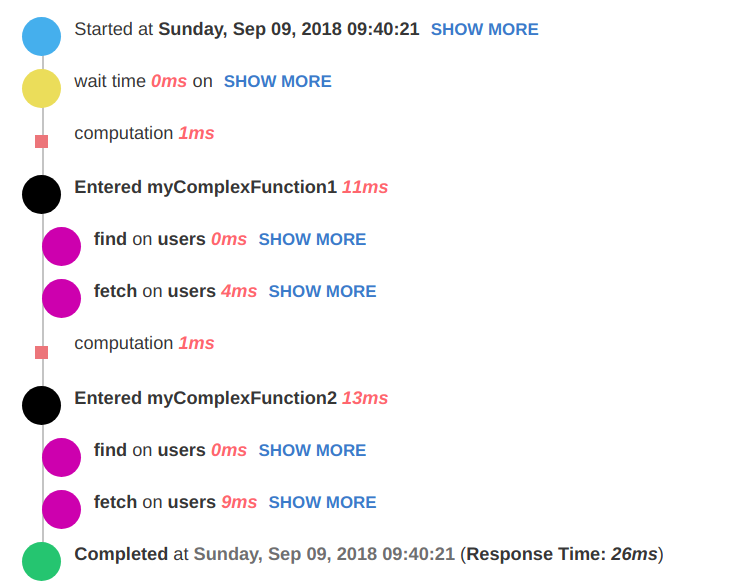
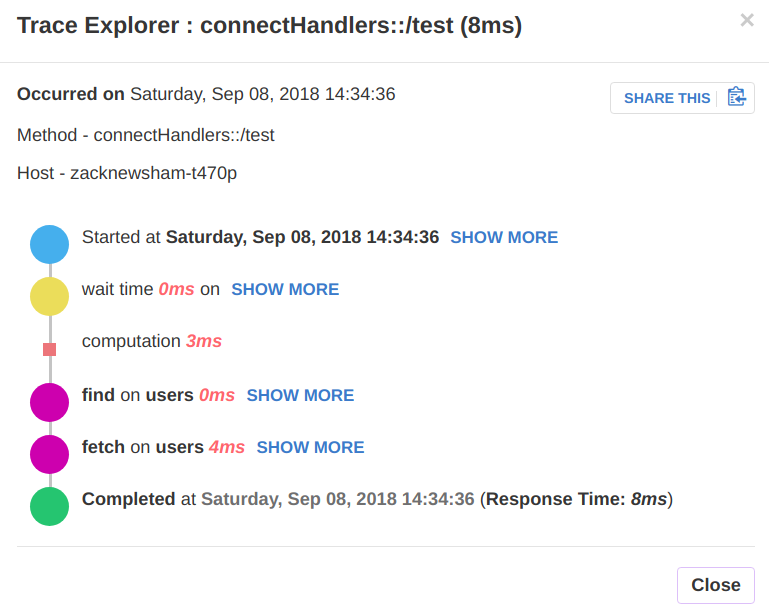

## [Kadira - Performance Monitoring for Meteor](https://kadira.io)

### Changes Compared to root Kadira

#### Kadira.tracer.forceTrace()
Ensure that a trace is logged for the current method or publication invocation. Useful to ensure traces are gathered on problematic, or high security methods. Also useful for logging traces when a method gets into a bad (but non-error) state.
```javascript
Meteor.methods({
  myProblematicMethod() {
    Kadira.tracer.forceTrace();
  }
}
```

#### Log traces (and errors) within Meteor.defer
If your method or publication uses `Meteor.defer` - errors thrown here aren't logged to Kadira and traces aren't gathered. Depending on how/when you use `Meteor.defer` this could leave a large gap in your analytics and error logging. The deferred call gets logged as either a method, or publication with the original name and "::deferred" appeneded. The original invoking context (userId, sessionId and params) is remembered.

```javascript
Metor.methods({
  testDefer() {
    Meteor.defer(() => {
      throw new Meteor.Error("test error");
    });
  }
});
```



```javascript
Metor.methods({
  anotherTestDefer() {
    Meteor.defer(() => {
      Meteor.users.findOne({_id: "test"});
    });
  }
});
```



#### Continue traces within an async callback
Kadira doesn't track calls made in any async callback, nor in the result of `map` or `foreach` of DB calls. This feature requires a UI update to the Kadira web app (and changes to the Kadira RMA service) to render nicely. These are a WIP but it will still work using the default UI.

For example, the following (ridiculous) example would log only 1 DB call and some `forEach` work.

```javascript
Metor.methods({
  testAsync() {
    Meteor.users.find({}, { limit: 1, fields: { _id: 1 } })
    .forEach((user) => {
      console.log(Meteor.users.findOne({ _id: user._id }))
    });
  }
});
```

| Old Kadira | New Kadira |
| ---------- | ---------- |
|  | |

Currently, the UI shows a start/end block for each async call wrapping the work that went on iside of it. The messy UI will be fixed to track each nested trace as a nested block of the parent.

#### Logging "zones" between function calls or arbitrary blocks of code
In complex functions it can be hard to determine where specific DB calls come from, this is particularly important during debugging for performance issues. This feature also requires an updated UI to render optimally, however will still work with the existing UI.

Consider the following example

```javascript
function myComplexFunction1() {
  console.log(Meteor.users.findOne({}));
}

function myComplexFunction2(_id) {
  console.log(Meteor.users.findOne({_id}));
}

Meteor.methods({
  testZones() {
    Kadira.tracer.traceFunction("myComplexFunction1", myComplexFunction1);
    Kadira.tracer.traceFunction("myComplexFunction2", () => myComplexFunction2(Meteor.userId()));
  }
});
```

| Without UI changes | With UI changes
|-|-|
|  | |
With the existing UI we have to track `zones` as DB calls - the trace within a zone behaves identically to an async block as discussed above, so you get "enter on ..., started, [trace], completed, exit on ...". As with the async blocks.

If for any reason you don't want to use the `traceFunction` method (which is a little clunky) you can also use the following:

```javascript
function myComplexFunction1() {
  const eventId = Kadira.tracer.enteredFunction("myComplexFunction1");
  console.log(Meteor.users.findOne({}));
  Kadira.tracer.eventEnd(Kadira._getInfo().trace, eventId);
}
```
Which is clunky in an entirely different way :)

#### Tracing within a webhook
This is a WIP but can be enabled with `Kadira.enableWebhookTracing`. You must call `request.on('end')` to end the wait time. You must call `response.end()` to log the method. Any errors thrown at the top level are logged. But not currently within the end callback. You must wrap all callbacks in `Meteor.bindEnvironment`

```javascript
WebApp.connectHandlers.use("/test", Meteor.bindEnvironment(function(request, response, next) {
  request.on("data", () => {});
  request.on("end", Meteor.bindEnvironment(function() {
    Meteor.users.findOne();
    response.writeHead(400);
    response.end();
  }));
}));
```


Until the UI updates are made to kadira webhooks get tracked as methods.
### Getting started

1. Create an account at <https://kadira.io>
2. From the UI, create an app. You'll get an `AppId` and an `AppSecret`.
3. Run `meteor remove meteorhacks:kadira` (if you installed it) in your project directory
4. Run `meteor add znewsham:kadira` in your project
5. Configure your Meteor app with the `AppId` and `AppSecret` by adding the following code snippet to a `server/kadira.js` file:

```
Meteor.startup(function() {
  Kadira.connect('<AppId>', '<AppSecret>');
});
```

Now you can deploy your application and it will send information to Kadira. Wait up to one minute and you'll see data appearing in the Kadira Dashboard.


### Auto Connect

Your app can connect to Kadira using environment variables or using [`Meteor.settings`](http://docs.meteor.com/#meteor_settings).

#### Using Meteor.settings
Use the followng `settings.json` file with your app:

```js
{
  ...
  "kadira": {
    "appId": "<appId>",
    "appSecret": "<appSecret>"
  }
  ...
}
```

The run your app with `meteor --settings=settings.json`.

#### Using Environment Variables

Export the following environment variables before running or deploying your app:

```
export KADIRA_APP_ID=<appId>
export KADIRA_APP_SECRET=<appSecret>
````

### Error Tracking

Kadira comes with built in error tracking solution for Meteor apps. It has been enabled by default.
For more information, please visit our [docs](http://support.kadira.io/knowledgebase/topics/62637-error-tracking) on [error tracking](http://support.kadira.io/knowledgebase/topics/62637-error-tracking).

### More information

Check out [Kadira Academy](https://kadira.io/academy) for more information and improve your app with Kadira.
